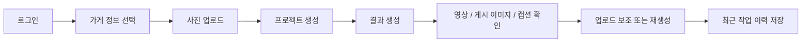
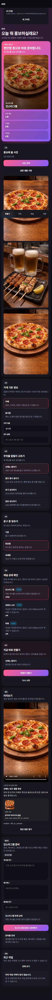
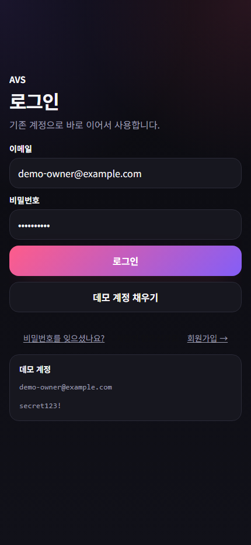
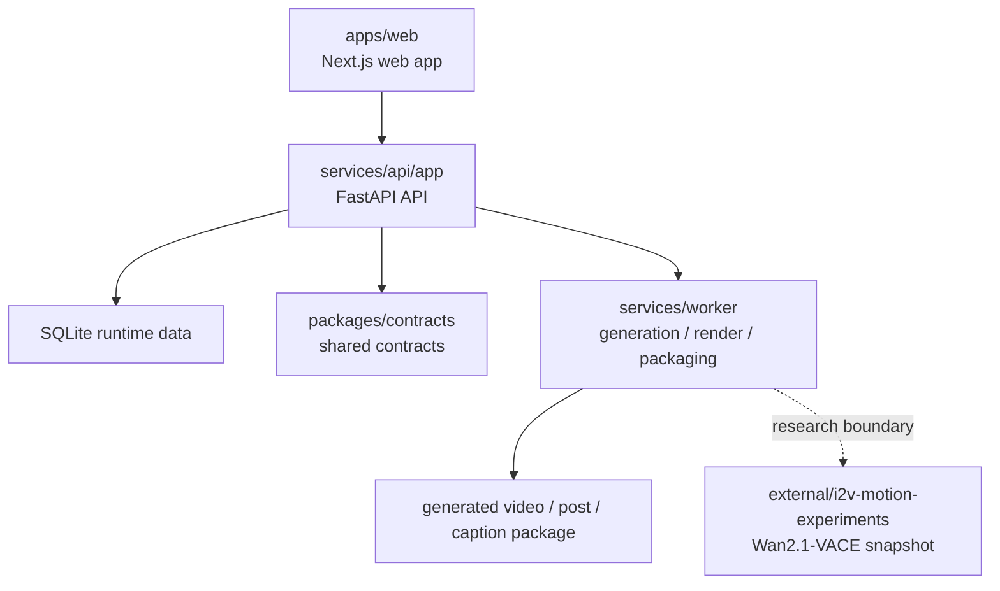

# AI6_5Team_Advanced_Project

매장 사진 몇 장과 몇 번의 선택만으로, 소상공인이 SNS용 숏폼 광고 초안을 만들고 게시 직전 단계까지 이어갈 수 있게 하는 팀 프로젝트입니다.

이 저장소는 발표용으로 급히 묶은 임시 폴더가 아니라, 팀원 작업을 하나의 서비스 흐름으로 정리한 **최종 통합 기준선**입니다.

## 프로젝트가 다루는 문제

소상공인이 직접 SNS 홍보를 하려면 보통 아래 일을 따로 해야 합니다.

- 사진 촬영
- 문구 작성
- 영상 편집
- 채널별 규격 정리
- 업로드 준비

이 과정은 생각보다 손이 많이 갑니다.  
특히 "무엇을 써야 할지 모르겠다", "영상까지 만들기는 부담스럽다", "채널별로 어떻게 올려야 할지 헷갈린다"는 문제가 반복됩니다.

이 프로젝트는 그 과정을 **선택형 입력 -> 결과 생성 -> 업로드 보조** 흐름으로 줄이는 데 초점을 맞췄습니다.

## 무엇을 만들었는가

현재 버전은 사용자가 자유 프롬프트를 길게 쓰는 방식이 아니라, 아래 순서로 바로 결과를 확인하는 구조입니다.

1. 로그인
2. 업종, 위치, 홍보 목적, 톤, 채널 선택
3. 이미지 업로드
4. 숏폼 결과 생성
5. 게시 이미지 / 캡션 / 해시태그 확인
6. 업로드 보조 패키지 확인
7. 최근 작업 이력에서 다시 열기

즉, 이 프로젝트의 핵심은 "영상 한 편을 잘 만드는 도구"보다, **홍보 작업 전체를 끝까지 이어 주는 서비스 흐름**에 있습니다.

## 현재 데모 범위

데모 기준으로 다루는 범위는 아래와 같습니다.

| 항목 | 범위 |
|---|---|
| 업종 | `카페`, `음식점` |
| 목적 | `신메뉴`, `할인/행사`, `후기`, `방문 유도` |
| 톤 | `기본`, `친근함`, `하찮고 웃김` |
| 채널 | `Instagram`, `YouTube Shorts`, `TikTok` |
| 업로드 방식 | `Instagram` 중심, 나머지는 업로드 보조 fallback |

앱에서 실제 돌아가는 생성 엔진은 trunk 내부 `Pillow + ffmpeg` 렌더러이며, `Wan2.1-VACE`는 별도 GPU 환경의 연구 스냅샷으로 보존했습니다.

## 핵심 사용자 흐름



## 화면 예시

### 메인 생성 화면



### 로그인 화면



### 생성 결과 예시


## 시스템 구성



### 현재 실제 생성 경로

지금 앱에서 실제로 돌고 있는 생성은 trunk 내부 렌더러입니다.

- [services/worker/pipelines/generation.py](services/worker/pipelines/generation.py)
- [services/worker/renderers/media.py](services/worker/renderers/media.py)

신유철의 Wan2.1-VACE 실험은 현재 저장소에 **스냅샷과 연동 경계**로 보존되어 있습니다.

- [external/i2v-motion-experiments](external/i2v-motion-experiments)
- [external/i2v-motion-experiments/TRUNK_SNAPSHOT.md](external/i2v-motion-experiments/TRUNK_SNAPSHOT.md)
- [services/worker/adapters/adapter_wan2_vace.py](services/worker/adapters/adapter_wan2_vace.py)
- [docs/testing/shin-vm-origin-verification-and-backup.md](docs/testing/shin-vm-origin-verification-and-backup.md)

즉, README만 보고도 아래를 구분해서 이해하시면 됩니다.

- 앱에서 실제로 검증한 것: 통합 서비스 흐름
- 모델 연구 축으로 보존한 것: Wan2 실험 저장소와 연동 경계

## 기술 스택

| 영역 | 사용 기술 |
|---|---|
| Frontend | Next.js, React, TypeScript |
| Backend | FastAPI, SQLite |
| Auth | Session cookie, token helper |
| Worker | Python, Pillow, ffmpeg / ffprobe |
| Contracts | workspace 내부 타입 표면과 shared schema |
| Research lane | Wan2.1-VACE experiment snapshot |

## 이번 버전에서 확인한 것

발표 기준으로 아래는 직접 검증했습니다.

- 회원가입 / 로그인 / `me`
- 프로젝트 생성
- 이미지 업로드
- 생성 요청 후 `generated` 상태 도달
- 결과 영상 / 게시 이미지 / 캡션 조회
- 업로드 보조 패키지 확인
- 웹 lint / build 통과
- API / worker 테스트 통과

관련 근거 문서는 아래에 있습니다.

- [docs/testing/test-scenario-186-root-selective-integration-freeze.md](docs/testing/test-scenario-186-root-selective-integration-freeze.md)
- [docs/testing/shin-vm-origin-verification-and-backup.md](docs/testing/shin-vm-origin-verification-and-backup.md)
- [docs/presentation/assets/README.md](docs/presentation/assets/README.md)
- [docs/daily/2026-04-23-codex.md](docs/daily/2026-04-23-codex.md)

## 아직 남아 있는 한계

이 프로젝트를 설명할 때 아래는 분명히 선을 그어야 합니다.

1. 신유철 Wan2 실험이 앱 런타임에 직접 붙어 실시간 추론하는 상태는 아닙니다.
2. 모든 SNS 채널 자동 업로드가 상용 수준으로 안정화된 상태는 아닙니다.
3. 운영용 queue / infra 구조는 최종 확정 상태가 아닙니다.
4. 일부 데이터와 흐름은 데모 기준선을 포함합니다.

즉, 현재 결과물은 **실제로 시연 가능한 MVP 기준선**이지, 운영형 완성 서비스라고 보는 것은 맞지 않습니다.

## 실행 방법

루트에서 아래 명령으로 실행할 수 있습니다.

```bash
npm run dev:api
npm run dev:web
```

Windows에서 바로 띄워 볼 때는 편의용 스크립트도 남겨 두었습니다.

```bat
start-api.bat
start-web.bat
```

검증은 아래 명령으로 돌립니다.

```bash
npm run api:test
npm run worker:test
npm run lint:web
npm run build:web
npm run check
```

### 데모 계정

- 이메일: `demo-owner@example.com`
- 비밀번호: `secret123!`

## 저장소 구조

```text
apps/web                         Next.js 웹 앱
services/api/app                 FastAPI API
services/worker                  생성 / 렌더링 / 업로드 보조 파이프라인
packages/contracts               공용 계약과 타입
external/i2v-motion-experiments  신유철 모델 실험 스냅샷
docs/prototypes                  UX 프로토타입
docs/archive                     보관용 문서와 이전 이력
docs                             발표 / 검증 / 실험 기록
```

## 개발 방식과 통합 과정

이 프로젝트는 처음부터 한 저장소에서 동시에 구현한 방식이 아니라, **기준 문서를 먼저 고정한 뒤 분산 개발하고 다시 trunk로 선별 통합한 방식**으로 진행했습니다.

1. 먼저 [`docs/planning/01_SERVICE_PROJECT_PLAN.md`](docs/planning/01_SERVICE_PROJECT_PLAN.md)부터 [`docs/planning/06_EVALUATION_TEST_AND_OPERATIONS.md`](docs/planning/06_EVALUATION_TEST_AND_OPERATIONS.md)까지 문서를 작성해 제품 범위, 화면 정책, 생성 파이프라인, API 계약, 데이터 구조, 평가 기준을 팀 공통 기준으로 배포했습니다.
2. 팀원들은 이 기준 문서를 바탕으로 각자 화면, 인증/API, worker, 모델 실험 축을 나누어 개발했습니다.
3. 이후 회의를 통해 결과물을 비교하면서 "무엇을 통째로 가져올지"가 아니라 "어떤 구현을 trunk 기준선으로 채택할지"를 기능 단위로 결정했습니다.
4. 최종적으로는 루트 저장소를 trunk로 삼고, 선택 통합 -> 재분장 -> 재통합 -> 검증 순서로 정리했습니다.

즉, 이 저장소는 단순히 작업물을 모아 둔 폴더가 아니라, **공통 설계 문서로 방향을 맞춘 뒤 회의를 통해 선택 통합한 결과물**입니다.

## 팀 작업 정리

이 저장소는 팀원별 작업을 그대로 모아 둔 아카이브가 아닙니다.  
각 축에서 실제로 남길 부분을 통합한 결과입니다.

- 임창현: `docs/planning/01~06` 기준 문서 작성/배포, trunk 기준선 설계, 팀 산출물 선택 통합 주도, 런타임·clean clone 검증, 발표 자산/문서 정리, 방향 실험 기록
- 신유철: Wan2.1-VACE 모델 실험 축
- 이진석: 모바일 앱형 UI 방향, 쿠키 인증/CSRF/rate limit/토큰 만료 UX 등 보안 강화
- 최무영: 로그인/인증/API 기본선
- 서유종: worker 구조 경계와 UX 프로토타입 흐름

상세 정리는 [docs/team-contributions-and-experiments.md](docs/team-contributions-and-experiments.md)에 따로 두었습니다.

## 문서 안내

문서 전체 색인은 [docs/README.md](docs/README.md)에 있습니다.

처음 보는 분이라면 아래 순서로 보시는 편이 빠릅니다.

1. 이 README
2. [docs/presentation/demo-checklist.md](docs/presentation/demo-checklist.md)
3. [docs/presentation/assets/README.md](docs/presentation/assets/README.md)
4. [docs/testing/README.md](docs/testing/README.md)
5. [docs/team-contributions-and-experiments.md](docs/team-contributions-and-experiments.md)

## Known Limitations (MVP 데모 환경 기준)

다음 항목들은 의도적으로 MVP 범위에서 제외했으며, 운영 배포 전 처리 예정입니다.

### 운영 배포 전 필수
- [ ] **레이트리밋 Redis 이전** — 현재 인메모리 슬라이딩 윈도우. 멀티 인스턴스 환경에서 카운트 분산 안 됨.
- [ ] **OAuth 토큰 갱신 Race Condition 방어** — `get_valid_access_token()` 동시 호출 시 refresh 충돌 가능성. Redis 분산 락으로 해결 예정 (`services/api/app/services/crypto.py` TODO 참조).
- [ ] **회원 탈퇴 시 도메인 전체 정리** — 자동화 팀의 예약 업로드 작업 정지 로직 추가 필요.
- [ ] **정책 개정 시 재동의 강제 플로우** — 현재 약관 버전 1개. 개정 발생 시점에 구현.

### Post-MVP 강화 항목
- [ ] Secret Manager 연동 (현재 환경변수)
- [ ] 정책 문서 CMS 분리 (현재 정적 페이지)
- [ ] Audit log HMAC 익명화 (현재 NULL)
- [ ] 2FA / Passkey / 소셜 로그인
- [ ] 활성 세션 목록 UI

---

## 요약

이 프로젝트는 소상공인용 SNS 광고 제작 흐름을 대상으로,  
로그인 -> 입력 선택 -> 생성 -> 결과 확인 -> 업로드 보조까지 이어지는 경험을 실제로 시연할 수 있도록 정리한 팀 프로젝트 기준선입니다.
