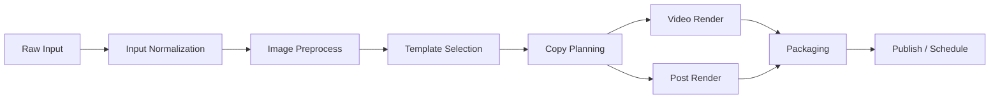
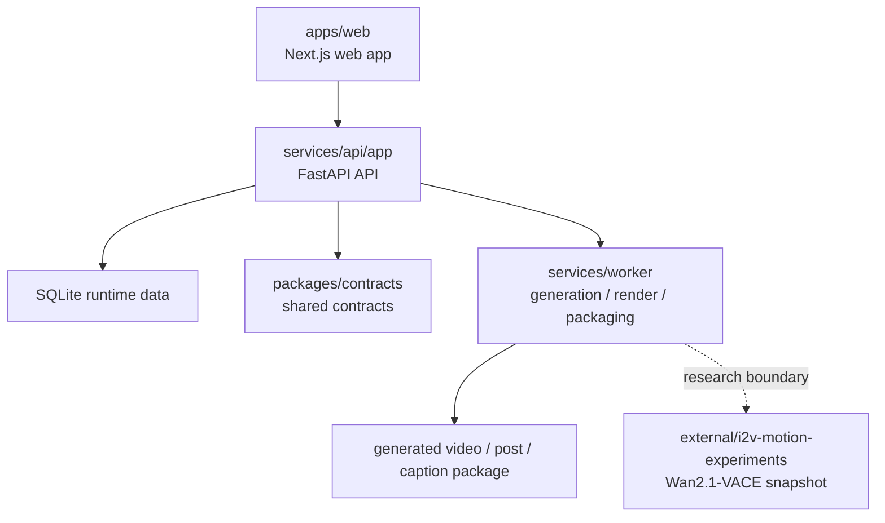

# AI6_5Team_Advanced_Project 보고서

> 이 문서는 발표자료와 포트폴리오 설명의 기준이 되는 프로젝트 보고서입니다.  
> 기준은 항상 현재 trunk이며, 개인 로컬 폴더나 중간 비교 자료가 아니라 공개 저장소 안에 남아 있는 코드와 문서를 근거로 작성합니다.

## 목차

1. 프로젝트 개요
2. 프로젝트 목표와 MVP 범위
3. 사용자 흐름과 화면 설계
4. 콘텐츠 생성 파이프라인
5. 시스템 구조와 통합 전략
6. 현재 구현 상태
7. 보안 및 인증 구현
8. 모델 연구 축과 보존 전략
9. 검증과 현재 기준선
10. 팀별 기여와 협업 방식
11. 한계와 다음 단계
12. 부록으로 같이 볼 문서

## 1. 프로젝트 개요

AI6_5Team_Advanced_Project는 소상공인이 매장 사진 몇 장과 간단한 선택만으로 SNS용 숏폼 광고 초안과 게시 보조 자료를 만들 수 있도록 설계한 팀 프로젝트입니다.

이 프로젝트가 해결하려는 문제는 명확합니다.

- 직접 촬영한 사진을 광고 문맥으로 다시 정리해야 합니다.
- 채널에 맞는 문구와 해시태그를 별도로 만들어야 합니다.
- 영상, 게시 이미지, 업로드 준비물을 여러 도구에 나눠서 처리해야 합니다.

즉, 기존에는 사진 촬영, 문구 작성, 영상 편집, 채널별 규격 정리, 업로드 준비라는 다섯 작업을 여러 도구에 나눠 처리해야 했고, 현재 trunk는 이를 하나의 앱 안에서 **선택형 입력 + 결과 확인 + 업로드 보조**까지 연결합니다.

현재 trunk는 이 흐름을 `로그인 -> 선택 -> 생성 -> 결과 확인 -> 업로드 보조`로 고정한 **시연 가능한 MVP 기준선**입니다.

근거 문서:

- [README.md](../../README.md)
- [01_SERVICE_PROJECT_PLAN.md](../planning/01_SERVICE_PROJECT_PLAN.md)

### 한눈에 보는 현재 기준선

이 보고서를 짧게 요약하면 아래 다섯 줄로 설명할 수 있습니다.

- 현재 trunk는 `로그인 -> 선택형 입력 -> 생성 -> 결과 확인 -> 업로드 보조 -> 이력 재진입`까지 실제로 시연 가능한 MVP 흐름입니다.
- 앱에서 실제로 동작하는 생성 엔진은 trunk 내부 `Pillow + ffmpeg` 렌더러입니다.
- 검증 근거는 API 테스트 26개, worker 테스트 85개, clean clone 기준 `npm run check` 통과까지 확보했습니다.
- Wan2.1-VACE는 앱 런타임 직접 추론이 아니라 연구 스냅샷과 VM 원본 검증 형태로 보존했습니다.
- 협업은 `planning 01~06 기준 문서 배포 -> 분산 개발 -> 기능 단위 선택 통합 -> 재검증` 순서로 진행했습니다.

## 2. 프로젝트 목표와 MVP 범위

초기 기획 기준에서 이 프로젝트의 목표는 “AI가 영상을 대신 만들어 주는 단일 기능”보다, 소상공인이 홍보 작업 전체를 끝까지 이어갈 수 있도록 **서비스 루프를 짧게 만드는 것**이었습니다.

초기에는 모델 품질 자체를 더 크게 보기도 했지만, 실제 사용 맥락에서는 GPU 성능보다 촬영 후 정리·문구 작성·채널별 준비에 드는 반복 작업이 더 큰 마찰이라는 판단이 분명해졌습니다. 그래서 이번 기준선은 “모델 하나를 끝까지 붙이는 일”보다 “홍보 작업 전체를 한 흐름으로 줄이는 일”을 우선으로 잡았습니다.

현재 데모 범위는 아래와 같습니다.

- 업종: `카페`, `음식점`
- 목적: `신메뉴`, `할인/행사`, `후기`, `방문 유도`
- 톤: `기본`, `친근함`, `하찮고 웃김`
- 채널: `Instagram`, `YouTube Shorts`, `TikTok`
- 업로드 방식: `Instagram` 중심, 나머지는 업로드 보조 fallback

즉, 이 프로젝트는 모든 SNS 채널을 완전 자동화한 운영 서비스가 아니라, **발표와 실제 시연이 가능한 MVP 기준선**을 목표로 삼았습니다.

근거 문서:

- [README.md](../../README.md)
- [01_SERVICE_PROJECT_PLAN.md](../planning/01_SERVICE_PROJECT_PLAN.md)
- [06_EVALUATION_TEST_AND_OPERATIONS.md](../planning/06_EVALUATION_TEST_AND_OPERATIONS.md)

## 3. 사용자 흐름과 화면 설계

사용자 흐름은 화면을 예쁘게 나누는 것이 아니라, 어떤 상태에서 어떤 입력을 받고 무엇이 결과로 돌아오는지를 고정하는 방식으로 설계했습니다.

대표 흐름은 다음과 같습니다.

1. 로그인
2. 업종, 위치, 목적, 스타일, 채널 선택
3. 사진 업로드
4. 프로젝트 생성 및 결과 생성
5. 영상, 게시 이미지, 캡션, 해시태그 확인
6. 업로드 보조 또는 재생성
7. 최근 작업 이력에서 다시 열기

실제 구현 화면은 `apps/web` 기준으로 유지했고, 발표 자산도 별도 폴더에 정리했습니다.

근거 문서:

- [02_USER_FLOW_AND_SCREEN_POLICY.md](../planning/02_USER_FLOW_AND_SCREEN_POLICY.md)
- [demo-checklist.md](demo-checklist.md)
- [presentation/assets/README.md](assets/README.md)
- [simple-workbench.tsx](../../apps/web/src/components/simple-workbench.tsx)
- [account-center.tsx](../../apps/web/src/components/account-center.tsx)

## 4. 콘텐츠 생성 파이프라인

이 프로젝트의 생성 파이프라인은 단순히 이미지를 영상으로 바꾸는 수준이 아니라, 입력 정규화와 템플릿 선택, 카피 구성, 영상 및 게시 이미지 생성, 패키징까지를 하나의 흐름으로 다룹니다.

문서 기준 파이프라인은 다음과 같습니다.

현재 trunk에서 실제로 돌아가는 생성 엔진은 `Pillow + ffmpeg` 기반의 내부 렌더러입니다. 즉, 앱은 실제로 결과를 생성할 수 있지만, 그 생성 경로는 별도 GPU 모델이 아니라 현재 저장소 안에 있는 로컬 렌더링 파이프라인입니다.

대표 구현 파일:

- [generation.py](../../services/worker/pipelines/generation.py)
- [media.py](../../services/worker/renderers/media.py)

근거 문서:

- [03_CONTENT_PIPELINE_AND_TEMPLATE_SPEC.md](../planning/03_CONTENT_PIPELINE_AND_TEMPLATE_SPEC.md)
- [README.md](../../README.md)
- [2026-04-23-codex.md](../daily/2026-04-23-codex.md)

## 5. 시스템 구조와 통합 전략

현재 시스템 구조는 아래 네 축으로 요약할 수 있습니다.

- `apps/web`: Next.js 기반 사용자 화면
- `services/api/app`: FastAPI 기반 인증, 프로젝트, 업로드, 채널 상태 API
- `services/worker`: 생성, 렌더링, 업로드 보조 파이프라인
- `packages/contracts`: 상태값과 스키마를 맞추는 공용 계약

### 5-1. 현재 구현과 목표 구조를 구분해서 봐야 하는 이유

planning 문서는 팀이 향해야 할 구조와 계약을 먼저 고정한 문서이고, 현재 trunk는 그중 발표 기준으로 실제로 동작하는 부분을 선택 통합한 결과입니다.  
따라서 보고서에서는 아래 두 층을 분리해서 써야 합니다.

| 구분 | 현재 trunk 기준 | planning 문서가 설명하는 목표 구조 |
|---|---|---|
| 인증 | HttpOnly session cookie 중심 | JWT/Bearer를 포함한 계약 문서 흔적 존재 |
| 데이터 저장 | SQLite runtime data | PostgreSQL + Object Storage + Redis 목표 구조 |
| 생성 엔진 | trunk 내부 `Pillow + ffmpeg` 렌더러 | 외부 모델 lane 포함 확장 구조 |
| 게시/연동 | 상태 전이 + 업로드 보조 중심 | 실서비스 외부 연동 확장 전제 |

즉, 보고서 본문에서는 **현재 구현**을 먼저 설명하고, planning 문서는 **설계 의도와 목표 구조**를 보조 근거로 쓰는 편이 정확합니다.

중요한 점은, 이 프로젝트가 처음부터 하나의 저장소에서만 구현된 것이 아니라는 점입니다.  
실제 협업은 다음 순서로 진행했습니다.

1. `docs/planning/01~06` 문서를 먼저 작성해 제품 범위, 화면 정책, 생성 파이프라인, API 계약, 데이터 구조, 평가 기준을 고정
2. 팀원별로 화면, 인증/API, worker, 모델 실험을 분산 개발
3. 회의를 통해 산출물을 비교하면서 폴더 단위 merge가 아니라 **기능 단위 선택 통합** 수행
4. 루트 저장소를 trunk로 고정하고 재분장 후 다시 통합
5. freeze 기준 검증과 clean clone 검증까지 마무리

즉, 이 저장소는 결과물 모음이 아니라 **설계 문서 기반 협업 -> 선택 통합 -> 재검증**을 거쳐 정리된 trunk입니다.

근거 문서:

- [10_ROOT_TRUNK_SELECTIVE_INTEGRATION_PLAN.md](../planning/10_ROOT_TRUNK_SELECTIVE_INTEGRATION_PLAN.md)
- [README.md](../../README.md)
- [team-contributions-and-experiments.md](../team-contributions-and-experiments.md)

## 6. 현재 구현 상태

현재 코드 기준으로 직접 시연 가능한 범위는 아래와 같습니다.

### 6-1. 웹

- 메인 생성 화면
- 로그인 / 회원가입 / 로그아웃
- 계정 설정
- 채널 연결 상태 화면
- 최근 작업 이력

대표 파일:

- [simple-workbench.tsx](../../apps/web/src/components/simple-workbench.tsx)
- [login/page.tsx](../../apps/web/src/app/login/page.tsx)
- [account/page.tsx](../../apps/web/src/app/account/page.tsx)
- [channels/page.tsx](../../apps/web/src/app/channels/page.tsx)

### 6-2. API

- 인증: 회원가입, 로그인, 로그아웃, 세션, `me`
- 비밀번호 재설정 / 변경
- 프로젝트 생성 / 조회
- 이미지 업로드
- 생성 요청 / 상태 조회 / 결과 조회
- 게시 요청 / 업로드 보조 완료
- 채널 연결 / callback / 상태 조회

대표 파일:

- [routes.py](../../services/api/app/api/routes.py)
- [security.py](../../services/api/app/core/security.py)
- [main.py](../../services/api/app/main.py)

현재 API 라우트 수는 `29개`이며, 이 안에 인증, 프로젝트, 업로드, 생성, 게시, 채널 연결 흐름이 들어 있습니다.

### 6-3. worker

- 이미지 전처리
- 템플릿 기반 카피 묶음 생성
- 영상 렌더링
- 게시 이미지 생성
- 업로드 보조 패키징
- 외부 모델 연동을 위한 adapter 경계

대표 파일:

- [generation.py](../../services/worker/pipelines/generation.py)
- [media.py](../../services/worker/renderers/media.py)
- [adapter_wan2_vace.py](../../services/worker/adapters/adapter_wan2_vace.py)

### 6-4. 계약

- `asset / auth / common / generation / project / publish / schedule / socialAccount / uploadAssist / worker` 10개 스키마를 `packages/contracts/schemas/`에서 관리합니다.

대표 파일:

- [packages/contracts/index.ts](../../packages/contracts/index.ts)
- [asset.ts](../../packages/contracts/schemas/asset.ts)
- [auth.ts](../../packages/contracts/schemas/auth.ts)
- [generation.ts](../../packages/contracts/schemas/generation.ts)
- [project.ts](../../packages/contracts/schemas/project.ts)
- [publish.ts](../../packages/contracts/schemas/publish.ts)
- [socialAccount.ts](../../packages/contracts/schemas/socialAccount.ts)
- [uploadAssist.ts](../../packages/contracts/schemas/uploadAssist.ts)
- [worker.ts](../../packages/contracts/schemas/worker.ts)

이 계약 계층은 프론트엔드와 백엔드가 enum, 상태값, 스키마 이름을 따로 하드코딩하지 않도록 맞추는 역할을 합니다.

### 6-5. 결과물 사양

- 출력 영상: `720x1280` 9:16 세로형 `mp4`, 현재 템플릿 기준 `5.5 ~ 6.4초`
- 출력 이미지: `1080x1080` 게시 이미지 `1장`
- 출력 텍스트: 캡션 옵션 `3종`, 해시태그 묶음 `1세트`, CTA 문구 `1종`

근거 파일:

- [media.py](../../services/worker/renderers/media.py)
- [T01-new-menu.json](../../packages/template-spec/templates/T01-new-menu.json)
- [T02-promotion.json](../../packages/template-spec/templates/T02-promotion.json)
- [T03-location-push.json](../../packages/template-spec/templates/T03-location-push.json)
- [T04-review.json](../../packages/template-spec/templates/T04-review.json)
- [test_api_smoke.py](../../services/api/tests/test_api_smoke.py)

## 7. 보안 및 인증 구현

이 프로젝트의 보안 축은 단순 로그인 구현을 넘어서, 발표 기준에서 설명 가능한 수준까지 정리되었습니다.

현재 코드와 테스트로 근거를 제시할 수 있는 항목은 아래와 같습니다.

- HttpOnly 세션 쿠키 기반 인증
- 비밀번호 해시
- 로그인 실패 잠금
- 동의/연령 게이트
- 비밀번호 재설정 단일 사용
- OAuth 토큰 AES-256-GCM 암호화 저장
- soft-delete / hard-delete 배치
- 감사 로그
- 일부 rate limit

대표 파일:

- [security.py](../../services/api/app/core/security.py)
- [rate_limit.py](../../services/api/app/core/rate_limit.py)
- [crypto.py](../../services/api/app/services/crypto.py)
- [test_security.py](../../services/api/tests/test_security.py)

현재 데모 및 서비스 기준선에서 검증 완료된 보안 구현 범위는 아래와 같습니다.

- 인증/세션 경계: HttpOnly 세션 쿠키, 세션 확인, 로그아웃 무효화
- 계정 보호: 비밀번호 해시, 로그인 실패 잠금, 연령/동의 검증
- 저장 보호: OAuth 토큰 AES-256-GCM 암호화, soft-delete / hard-delete 배치
- 요청 보호: unsafe method에 대한 origin / referer 기반 CSRF 차단, 로그인/회원가입/비밀번호 재설정 rate limit

다만 아래 표현은 조심해야 합니다.

- “보안이 완전히 끝났다”
- “실운영 수준의 외부 SNS 보안 검증까지 완료했다”

현재 근거는 **데모 기준 보안 강화와 테스트 근거**까지입니다.

## 8. 모델 연구 축과 보존 전략

Wan2.1-VACE 연구 축은 현재 앱 런타임과 직접 결합된 상태가 아니라, **연구 축을 trunk 안에 보존하고 adapter 경계로 연결한 상태**입니다.

이 축에서 현재 말할 수 있는 사실은 아래와 같습니다.

- `external/i2v-motion-experiments`에 실험 스냅샷 보존
- GCP VM 원본 레포와 trunk 스냅샷의 커밋 일치 확인 (`6ea9ffc`)
- VM 경로, GPU, Docker 상태, outputs/logs 존재 확인
- 발표용 최소 백업 번들 확보

즉, 연구 축의 실재성과 보존은 근거가 충분합니다.  
하지만 아래 표현은 사용하면 안 됩니다.

- “Wan2.1-VACE가 현재 앱 안에서 직접 실시간 추론한다”
- “모델 통합이 완전히 끝났다”

근거 문서:

- [shin-vm-origin-verification-and-backup.md](../testing/shin-vm-origin-verification-and-backup.md)
- [TRUNK_SNAPSHOT.md](../../external/i2v-motion-experiments/TRUNK_SNAPSHOT.md)
- [adapter_wan2_vace.py](../../services/worker/adapters/adapter_wan2_vace.py)

## 9. 검증과 현재 기준선

현재 보고서에서 강하게 말할 수 있는 검증 범위는 아래와 같습니다.

- API 테스트 함수 26개
- worker 테스트 함수 85개
- 총 111개 테스트 함수
- 최신 clean clone 기준 `npm ci` 후 `npm run check` 통과
- 실제 앱 생성 경로에서 `generated` 상태까지 도달 확인
- 발표 자산 6개 정리 완료

또한 현재 공개 저장소 기준으로 아래 사실도 확인할 수 있습니다.

- planning 핵심 문서 10개 유지
- 웹 앱 기준 주요 app directory 14개
- worker 레이어를 `adapters / pipelines / renderers`로 분리
- 발표 자산은 app 4개, model 2개로 구분

검증 근거는 다음과 같습니다.

- [docs/testing/README.md](../testing/README.md)
- [test-scenario-186-root-selective-integration-freeze.md](../testing/test-scenario-186-root-selective-integration-freeze.md)
- [test_api_smoke.py](../../services/api/tests/test_api_smoke.py)
- [test_security.py](../../services/api/tests/test_security.py)
- [services/worker/tests](../../services/worker/tests)
- [2026-04-23-codex.md](../daily/2026-04-23-codex.md)

## 10. 팀별 기여와 협업 방식

이 프로젝트의 협업 방식은 “각자 만들고 마지막에 그냥 합친 것”이 아니라, **기준 문서 선행 -> 분산 개발 -> 선택 통합 -> 재분장 -> 재통합** 구조였습니다.

현재 공개 trunk 기준으로 정리할 수 있는 역할은 아래와 같습니다.

- 임창현(리드): 기준 문서 배포, trunk 선택 통합, 검증/발표 자산 정리
- 신유철: Wan2.1-VACE 실험 축, VM 원본 검증
- 이진석: 모바일형 화면 톤, 인증/보안 강화, 채널 연동 UX
- 최무영: 로그인/인증/API 기본선
- 서유종: worker 구조 경계, UX 프로토타입

이 과정을 엔지니어링 관점에서 보면, 기준 문서와 계약을 먼저 고정해 병렬 개발 충돌을 줄인 `Plan`, 각 축의 구현을 병렬로 진행한 `Do`, 산출물을 비교하면서 기능 단위 선택 통합과 검증을 반복한 `Check`, trunk 기준선 재정리와 재분장을 통해 발표용 기준을 고정한 `Act`의 흐름으로 설명할 수 있습니다.

자세한 설명은 아래 문서를 근거로 삼는 편이 맞습니다.

- [team-contributions-and-experiments.md](../team-contributions-and-experiments.md)

## 11. 한계와 다음 단계

아래 항목들은 단순 미완료 목록이 아니라, 발표 주기 안에서 의도적으로 그은 스코프 컷입니다. 운영형 인프라와 외부 모델 직접 추론까지 한 번에 안정화하기보다, 로그인 -> 선택 -> 생성 -> 결과 -> 업로드 보조 루프가 실제로 끊기지 않는 기준선을 먼저 고정하는 쪽이 발표와 검증 모두에 더 유리하다고 판단했습니다. 특히 Wan2.1 계열은 별도 GPU 환경과 상대적으로 긴 추론 시간을 전제로 하므로, 이번 기준선에서는 시연 안정성과 응답 흐름을 우선해 trunk 내부 렌더러를 기본 생성 경로로 두고 연구 축을 별도로 보존했습니다.

현재 결과물을 설명할 때는 아래 한계를 분명히 인정해야 합니다.

1. Wan2 실험은 앱 런타임 직접 추론이 아니라 연구 스냅샷과 adapter 경계 수준입니다.
2. 외부 SNS 자동 게시 전체를 상용 수준으로 검증한 것은 아닙니다.
3. 운영용 queue / infra 구조는 최종 확정 상태가 아닙니다.
4. 일부 데이터와 흐름은 demo-state를 포함합니다.
5. 사용자 테스트 기준 문서는 있으나, 결과를 독립적으로 요약한 별도 근거는 약합니다.

다음 버전에서는 사용자 피드백 수집 절차와 그 결과를 별도 문서로 정리하는 작업이 우선 과제입니다.

그럼에도 현재 기준선은 다음 가치를 가집니다.

- 사용자 흐름이 실제로 이어집니다.
- 인증, 생성, 결과 확인, 게시 fallback, 채널 상태 반영까지 데모 경로가 살아 있습니다.
- 팀원 작업물을 trunk 기준으로 설명 가능한 상태로 정리했습니다.
- 발표자료와 포트폴리오로 옮길 수 있는 문서/자산/검증 근거가 갖춰져 있습니다.

## 12. 부록으로 같이 볼 문서

- [docs/README.md](../README.md)
- [demo-checklist.md](demo-checklist.md)
- [presentation/assets/README.md](assets/README.md)
- [01_SERVICE_PROJECT_PLAN.md](../planning/01_SERVICE_PROJECT_PLAN.md)
- [10_ROOT_TRUNK_SELECTIVE_INTEGRATION_PLAN.md](../planning/10_ROOT_TRUNK_SELECTIVE_INTEGRATION_PLAN.md)
- [test-scenario-186-root-selective-integration-freeze.md](../testing/test-scenario-186-root-selective-integration-freeze.md)
- [shin-vm-origin-verification-and-backup.md](../testing/shin-vm-origin-verification-and-backup.md)

---

### 보고서 작성 시 표현 원칙

- “현재 되는 것”과 “연구 축”을 분리해서 적습니다.
- “목표 구조”와 “현재 구현”을 섞어 쓰지 않습니다.
- 테스트와 문서로 확인된 범위만 단정적으로 씁니다.
- 그 외는 “후속 과제”, “연구 축”, “보존된 스냅샷”, “목표 아키텍처”로 구분해 씁니다.
